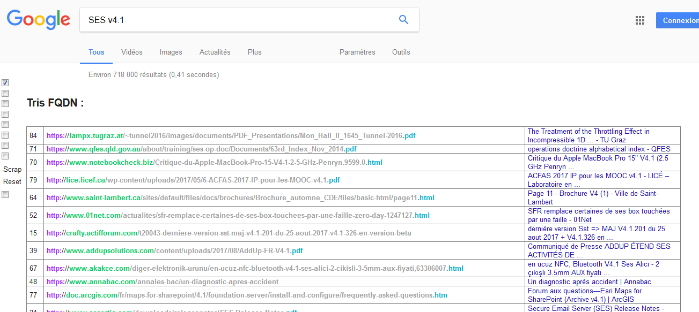
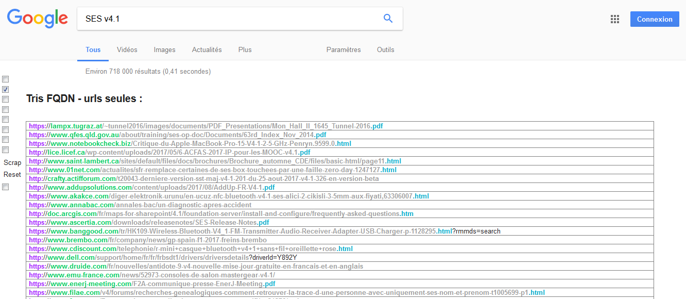
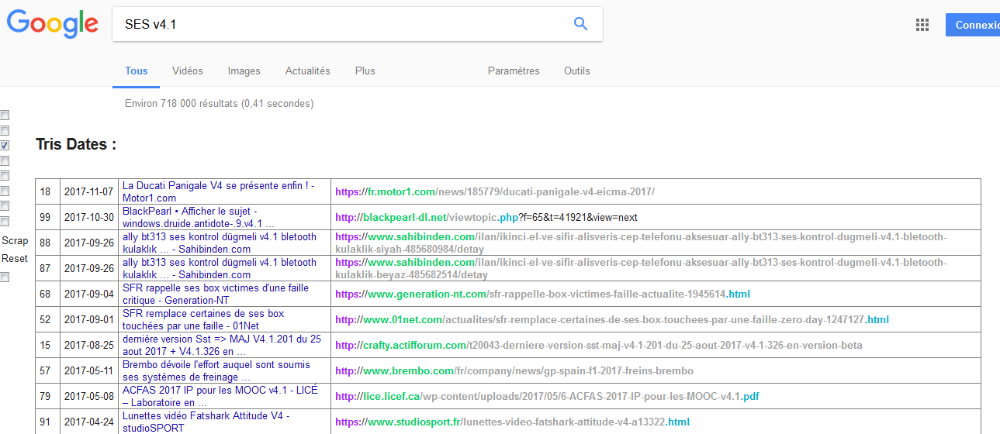
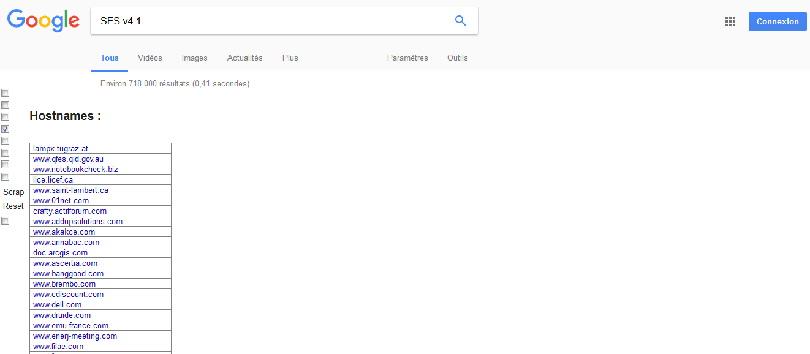
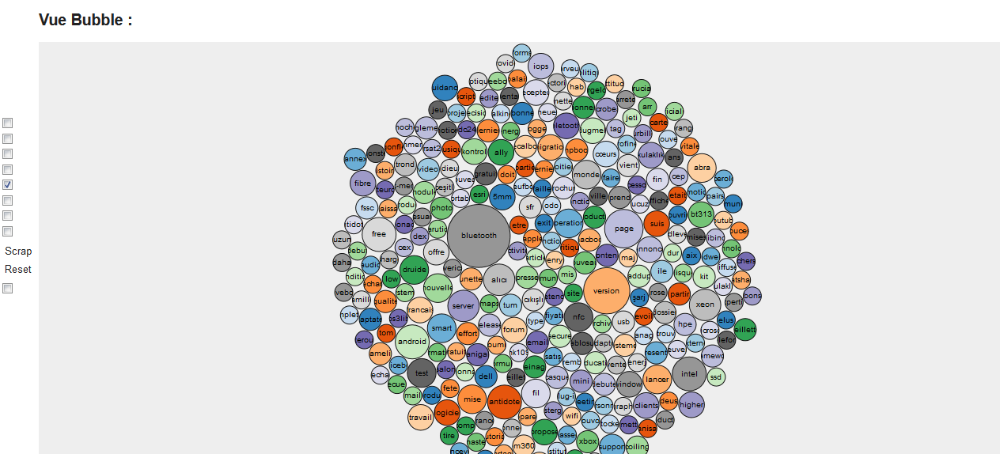
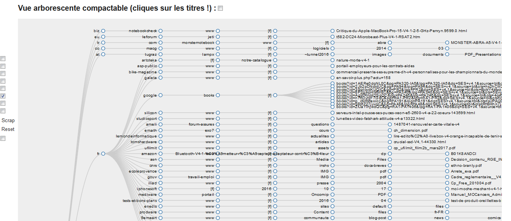
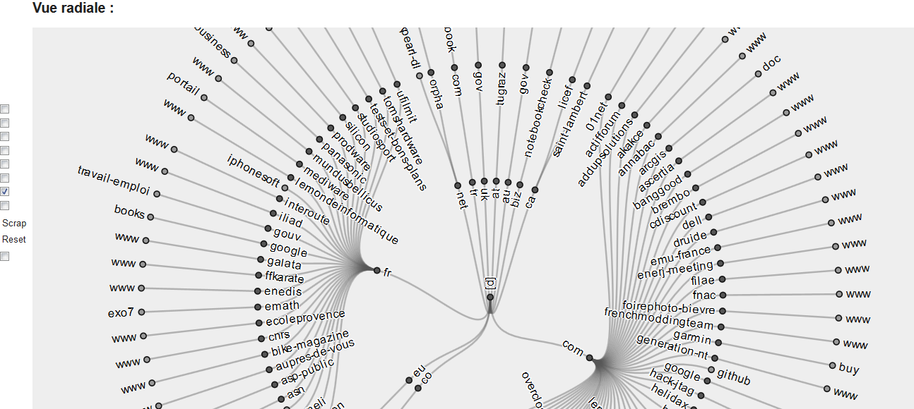
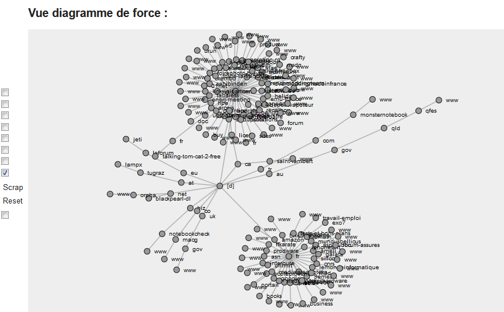

GNU General Public License, version 3.

* Search Engine Scraper (SES_v4_1 https://www.youtube.com/watch?v=DbvNphZcQDE) is a Greasemonkey 4.0 script helping to scrap and format results from Google and Bing searches.
* It's fonctionnal with Firefox 57.x and www.google.fr, www.google.com, www.bing.com ; not tested with others domains, but you can change global variables to include your country tld (google / bing).
* Just disable it when you don't search specific things ; it could create bugs with specific situations ... 

# FEATURES :
* A special toolbox is added on the left of the Google page and you can switch into different views.
* In order :
1. **FQDN Sorted View** 		-> display (rank,urls,title) sorted by (reversed domain ie : tld.domain.sub[..], path+search+hash)
2. **FQDN View** 				-> display (urls) sorted by (reversed domain ie : tld.domain.sub[..], path+search+hash)
3. **Date View** 				-> display (rank, date if present, title, url) sorted by date
 **Hostname View**             -> display deduplicated and sorted domains
4. **Bubble Graph** 			-> display Bubbles with keywords frequencies filtered by (Zipf law for english(128 first words non relevants) ; wordlist for french, len > 2, F > 1) - use it to see what is the added noise on your search
5. **Collapsible Tree Graph** 	-> Tree with url join on "domains, folders, files", collapsible & zoom
6. **Force Layout Graph** 		-> Tree with url join on "domains" with forces between nodes, collapsible & zoom
7. **Radial Graph** 		    -> Radial Tree with url join on "domains" with forces between nodes, collapsible & zoom
8. **"Scrap"** : Wait until it scrap the results by 100 with the keyword you entered in the Google search box (1 to 7/8 pages refresh with 2 to 4 second waiting between each) and display the result in the page. Use then the différent checkbox to format results
9. **"Reset"** : cancel the scrap on next refresh
10. "filter" : check it to scrap and search with **filter=0**

* Disable useless checkboxes after line 717 of code.

* Only "Scrap" will refresh page ressource with GET (no ajax) ;
* The page search is also modified (display by 100, filter=0)
* Google proxy on urls is removed ; (when you click on results)
* cnso and so on are also removed
* NID cookie is http-only so I think can't be removed ;
* Well ... it doesn't rise captchas when I use it ...

# INSTALL :
* Don't forget to logout from your Google account before using it ;
* In firefox -> create a GreaseMonkey 4.0 script and copy/paste the script on it;
* Enjoy !

# SCREENS

# CODE OVERVIEW :

* Hell ... just developped it quick ;
* "Parametre" object is used to group parameters retrievial and parsing ;
* "Recherche" object is used when you click the scrap button ;
* "SearchEnginePage" object is used to change the search engine page (it remove useless things, and so on.) ;
